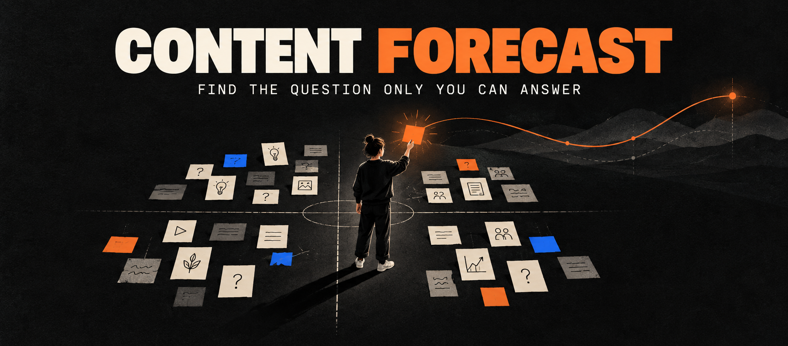
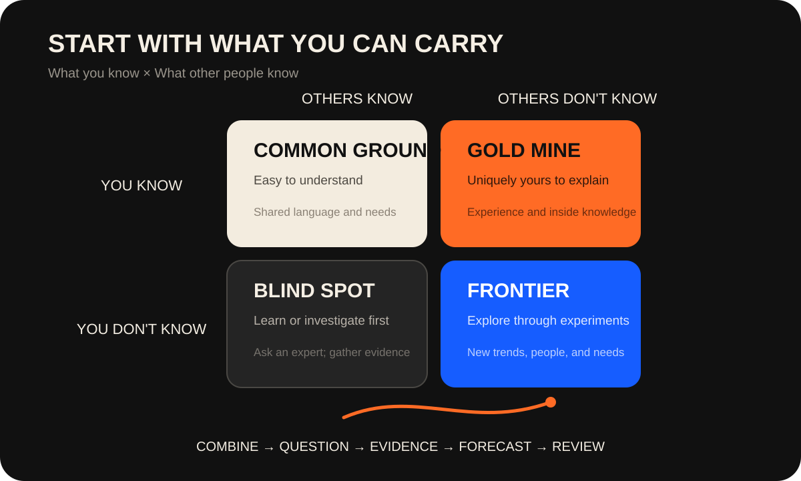
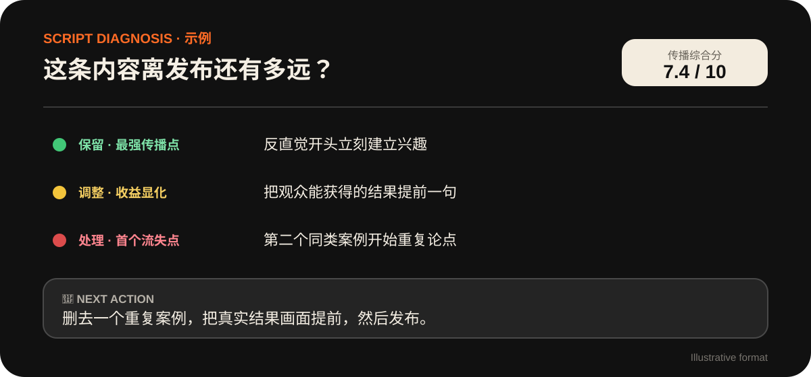
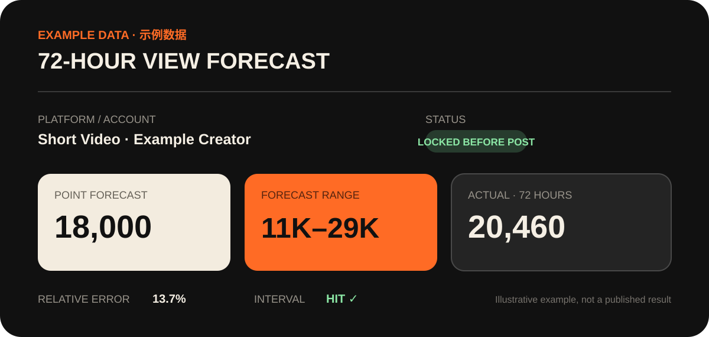

<p align="center">
  
</p>

<h1 align="center">Content Forecast</h1>
<p align="center"><strong>Before choosing a topic, ask why you are the right person to talk about it.</strong></p>
<p align="center"><strong>English</strong> · <a href="README.zh-CN.md">简体中文</a></p>

<p align="center">
  
  
  
  
</p>

## Why I built this

There are already plenty of tools that find trends, reverse-engineer viral posts, and generate topic ideas.

But I have always believed that the trend should not come before the creator.

The same topic does not work equally well for everyone. You may know something others cannot explain. A topic that works for someone else may become nothing more than a correct but useless paragraph in your hands.

That is why I built Content Forecast.

It first learns who you are, what you have done, and what you know. Then it helps you find questions you can actually carry. After reading your material, the Agent may ask: **What specific experience made you realize this?**

## Your value matters more than the trend

Content Forecast maps ideas across two axes:

- what you know and do not know;
- what other people know and do not know.

<p align="center">
  
</p>

The Agent suggests examples based on your identity, but you decide where every term belongs. As you learn, work on new projects, or gain new experience, you can update the map at any time.

You can also add, delete, or move terms at any time—or send the Agent a topic you want to discuss and ask where it belongs.

## How a topic is created

Imagine you work in the beauty industry:

- “luxury dupes” sits in Common Ground;
- “product cost” sits in your Gold Mine.

Combine them and you get a question worth answering:

> **Do luxury dupes really cost less to make than luxury products?**

The Agent does not invent the answer. It asks whether you have a real experience, data point, product, or case that can answer the question. If the evidence is missing, it tells you what to investigate, test, or film next.

Choose a question you can carry. Solve it. Show the result.

## Three steps to forecast a piece of content

1. **🧭 Let it know you once** — build a creator map, three audience groups, content direction, and four quadrants; reuse and update them later.
2. **🧩 Complete the next piece** — choose from three tailored topics, write your draft, and receive a diagnosis of its strongest spread point, first drop-off, likely audience, and required changes.
3. **🔮 Forecast how it may spread** — predict what drives the content, whom it may attract, and—when representative history is available—whether it may perform above, near, or below your content baseline.

Visual cues stay consistent: 🟢 keep, 🟡 adjust, 🔴 must fix; the map uses 🔵 Common Ground, 🟡 Gold Mine, 🔴 Blind Spot, and 🟣 Frontier.

<p align="center">
  
</p>

## Why not just ask AI to write the post?

A polished script is not the same as content that only you can make.

Most AI writing tools begin with “What do you want to write?” Content Forecast keeps asking:

- Where did this question come from?
- Why should you answer it?
- What will make the audience believe you?
- Who is this content meant to attract?

The script remains yours. The Agent helps you see the question clearly, review the expression, and turn each project into a content map that grows with you.

## It forecasts how content may spread

Once the script is locked, Content Forecast identifies the strongest spread point, first likely drop-off, likely audience, interaction direction, and largest variable. For a numerical comparison, upload three recent, similar posts that represent your normal performance—not obvious outliers.

<p align="center">
  
</p>

Three samples create a temporary content baseline. Future results gradually strengthen the long-term baseline. The forecast emphasizes direction relative to baseline, with a wide range and explicit conditions, and cannot be rewritten after the actual result is known.

## Start

After installation, tell your Agent:

```text
Initialize Content Forecast
```

It will ask you to introduce yourself and help you build your first four-quadrant map. Later, you can say:

```text
Add several terms to my Gold Mine.
Combine Common Ground and Gold Mine into three topics.
I confirm this topic. Here is my script.
Review the script and tell me what to do next.
Here are my historical posts and view data. Forecast this video.
```

## Installation

Clone or download the complete project, then run:

```bash
bash install.sh codex
```

Use `bash install.sh claude` for Claude Code or `bash install.sh all` for both. On Windows:

```powershell
.\install.ps1 -Target codex
```

Uninstall with `bash uninstall.sh codex` or `.\uninstall.ps1 -Target codex`. Uninstalling the Skill does not remove the separate `content-forecast-data/` directory.

## Update

From the cloned repository, run:

```bash
bash update.sh codex
```

Use `bash update.sh claude` for Claude Code or `bash update.sh all` for both. On Windows:

```powershell
.\update.ps1 -Target codex
```

The updater fetches the latest GitHub version, replaces the installed Skill, and leaves the separate `content-forecast-data/` directory untouched. Start a new Agent session after updating.

The host Agent needs file access. Forecast calculations require Python 3 and use only the standard library. Web access is optional. The GitHub page itself does not run the Skill.

See [examples/walkthrough.md](examples/walkthrough.md) for a complete example and [templates/history.csv](templates/history.csv) for the historical data format. Personal records are stored separately in `content-forecast-data/` and should not be committed to the public repository.

## About the author

I am Colin, a creator focused on AI, content, and practical business experiments.

Content Forecast cannot tell you how everything will end. But while using it, you may realize that the only way to predict the future is to create it.

I created Content Forecast. Now you are seeing it.

If it helps you produce something only you could have made, consider giving the repository a Star.

If a forecast fails, you are also welcome to share an anonymized result in Issues. A failed forecast may teach us more than another claim that “it is accurate.”

Start by understanding who you are and finding questions you are uniquely equipped to answer. Record your judgment before publishing, then let every real result guide the next piece of content.
