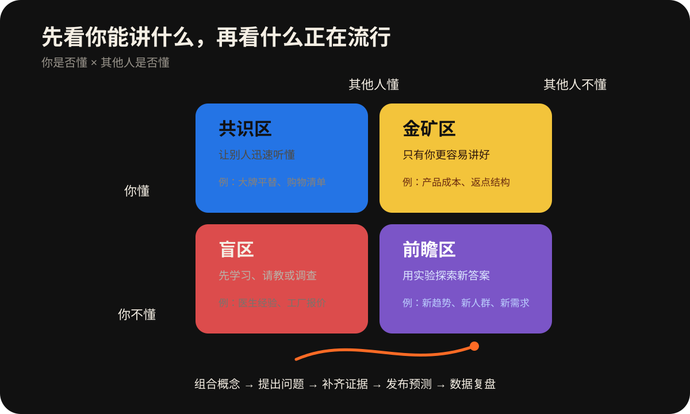

<p align="center">
  
</p>

<h1 align="center">Content Forecast</h1>
<p align="center"><strong>找选题之前，先搞清楚：这个问题为什么适合你讲？</strong></p>
<p align="center"><a href="README.md">English</a> · <strong>简体中文</strong></p>

<p align="center">
  
  
  
  
</p>

## 我为什么做这个 Skill

市面上已经有很多帮人找热点、拆爆款、生成选题的工具了。

但我一直觉得，热点不应该排在你前面。

同一个选题，不是所有人都能讲好。别人讲不好的东西，你可能刚好知道；别人能讲好的东西，放在你这里可能只剩下一段正确但没用的话。

所以我做了 Content Forecast。

它会先了解你是谁、做过什么、知道什么，再帮你找到那些你真正能接住的问题。例如，Agent 在看完你的材料后会追问：**你是在什么具体经历里意识到这个问题的？**

## 你自身的价值比热点更重要

Content Forecast 会让你画出两条轴：

- 你知道什么，你不知道什么；
- 其他人知道什么，其他人不知道什么。

<p align="center">
  
</p>

共识区让别人迅速听懂你在说什么。

金矿区装着你的经验、行业信息和别人不容易获得的认识。

盲区告诉你哪些内容应该先学习、请教，而不是假装自己知道。

前瞻区适合用实验和探索寻找新答案。

Agent 会根据你的身份给出填词示例，但最后由你决定每个词应该放在哪里。以后你学会了新东西、做了新项目，也可以随时更新这张地图。

你也可以随时添加、删除或移动词汇，或者直接把最近想讲的选题发给 Agent，让它判断应该放入哪个象限。

## 一个选题是怎么被组合出来的

假设你是一名美妆从业者：

- 共识区里有“大牌平替”；
- 金矿区里有“产品成本”。

把两个词组合，就会得到一个值得回答的问题：

> **大牌平替的成本，真的比大牌低吗？**

这时 Agent 不会直接编一个答案。

它会继续问：你有没有真实经历、数据、产品或案例能够回答这个问题？如果材料不够，下一步应该调查什么、测试什么、拍下什么？

先选择你能接住的问题，再解决它、展示结果。

## 三步完成一次内容判断

1. **🧭 认识你一次**：建立创作者地图、三类受众、内容主线和四象限，以后直接复用并随时更新。
2. **🧩 完成下一条内容**：生成三个适合你的选题；你交回初稿后，Agent 判断最强传播点、首个流失点、主要吸引人群和必须修改的位置。
3. **🔮 预测它会如何传播**：判断内容靠什么传播、可能吸引谁；有代表性历史数据时，再预测相对内容基线的升降方向和区间。

默认诊断使用统一视觉提示：🟢保留、🟡调整、🔴必须处理；四象限使用🔵共识、🟡金矿、🔴盲区、🟣前瞻。发布后的真实结果可以继续更新基线，但复盘不会阻挡下一条创作。

<p align="center">
  
</p>

## 为什么不是直接让 AI 帮你写一篇

因为一段像样的文案，并不等于一条只有你能讲好的内容。

普通的 AI 内容工具往往从“你想写什么”开始。Content Forecast 会继续向前追问：

- 这个问题从哪里来？
- 为什么由你来回答？
- 你拿什么让观众相信？
- 这条内容到底吸引谁？

稿子仍然是你的。Agent 帮你看清问题、审核表达，并把创作过程变成可以持续积累的个人内容地图。

## 它会预测内容如何传播

定稿之后，Content Forecast 会先判断最强传播点、首个流失点、可能吸引的人、互动方向和最大变量。第一次需要数据预测时，再上传3条能代表日常水平的内容后台数据。避开明显过高或过低的异常作品，尽量选择近期、同类型、正常发布的内容。

<p align="center">
  
</p>

三条数据建立临时内容基线，后续结果会逐渐补充成长时期基线。预测以“高于、接近或低于基线”为主，同时给出宽区间和成立条件；看到实际结果后不会回改原预测。

## 开始使用

安装完成后，对 Agent 说：

```text
初始化 Content Forecast
```

它会先请你介绍自己，然后陪你建立第一张四象限地图。以后可以直接说：

```text
我想给金矿区补充几个词
帮我用共识区和金矿区组合三个选题
我确认这个选题，这是我写的文案
帮我审核文案，并告诉我下一步应该做什么
这是我的历史内容和播放数据，帮我预测这条视频
```

## 安装

克隆或下载完整项目后运行：

```bash
bash install.sh codex
```

安装到 Claude Code 使用 `bash install.sh claude`，同时安装到两者使用 `bash install.sh all`。Windows 用户运行：

```powershell
.\install.ps1 -Target codex
```

卸载使用 `bash uninstall.sh codex` 或 `.\uninstall.ps1 -Target codex`。卸载 Skill 不会删除独立保存的 `content-forecast-data/`。

## 更新

进入克隆到电脑的仓库目录后运行：

```bash
bash update.sh codex
```

更新 Claude Code 使用 `bash update.sh claude`，同时更新两者使用 `bash update.sh all`。Windows 用户运行：

```powershell
.\update.ps1 -Target codex
```

更新脚本会从 GitHub 获取最新版、替换已安装的 Skill，并保留独立的 `content-forecast-data/` 个人资料目录。更新后请重新打开一个 Agent 会话。

需要宿主 Agent 支持文件读写。数据计算需要 Python 3，仅使用标准库；联网检索是可选能力。GitHub 页面本身不会运行这个 Skill。

完整示例见 [examples/walkthrough.md](examples/walkthrough.md)，历史数据格式见 [templates/history.csv](templates/history.csv)。个人记录会保存在独立内容工作目录的 `content-forecast-data/`，不上传到公共仓库。

## 关于作者

我是 Colin，一名关注 AI、内容和商业实践的创作者。

Content Forecast 不会帮你猜测事情的结局。但当你在使用它时，你会明白：预测未来的唯一方式，就是创造它。

就像我创造了 Content Forecast，而现在，你看到了它。

如果在 Content Forecast 的帮助下，你生产出了一条世界上只有你能讲好的内容，欢迎点一个 Star。

如果预测失败，也欢迎把脱敏后的结果发到 Issues。失败的预测，可能比一句“它真的很准”更有价值。

从认识你开始，找到只有你更适合回答的问题；从发布前的判断开始，让每一次真实结果都成为下一条内容的依据。
